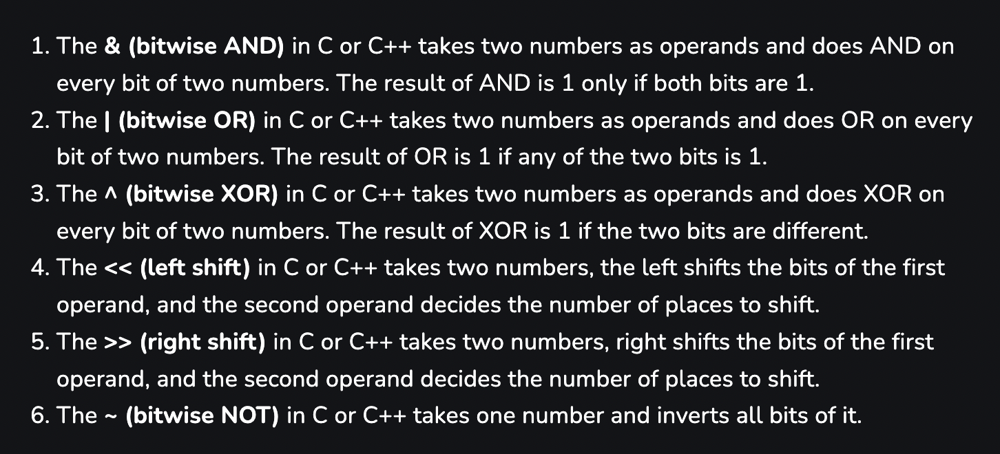

# 💀 operators

<figure><figcaption></figcaption></figure>

Loop through bits (from last bit to first):

```cpp
while (n) {
    cout << n & 1; 
    n >>= 1;
}
```

\_\_builtin\_popcount: count set (1) bits

[https://liuzhenglaichn.gitbook.io/algorithm/bit-manipulation](https://liuzhenglaichn.gitbook.io/algorithm/bit-manipulation)
