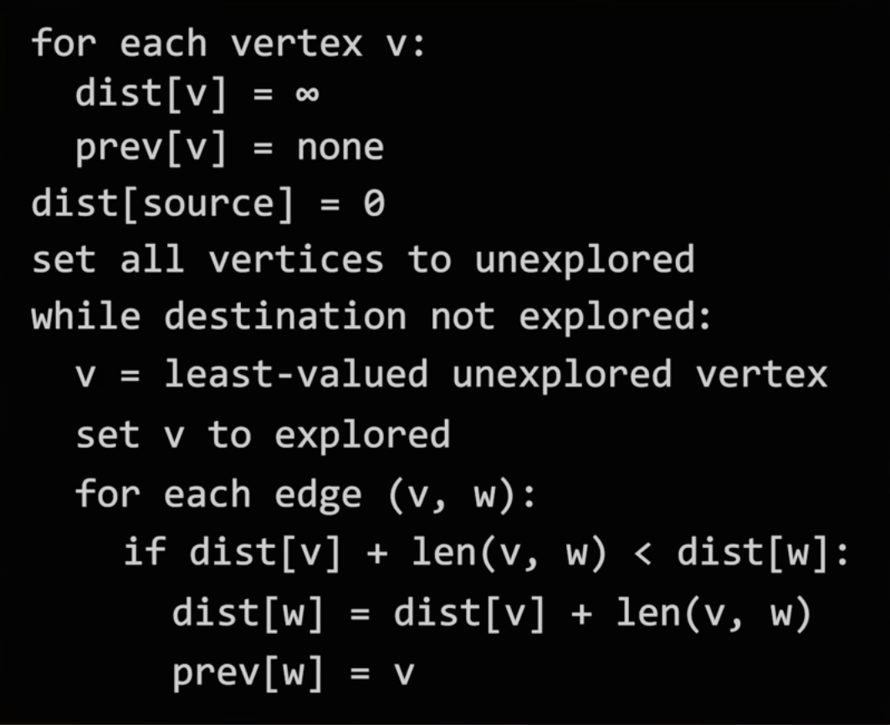

# dijkstra shortest path

Time complexity: O(V^2) with array, O(V + ElogV) with min-priority queue (heap)

Intuition: label each vertex with least cost found so far

1. update estimate required to get to vertex
2. choose next vertex to explore edges (smallest estimated cost)

<figure><figcaption><p>Dijkstra's shortest path pseudocode</p></figcaption></figure>

Note: because Dijkstra's greedily selects the min edge weight, it cannot handle negative weights (negative weight cycle).

```cpp
#include <bits/stdc++.h>
#include "graph.cpp"

using namespace std;

void dijkstra(string start, Graph graph) {
    unordered_map<string, int> distance;
    unordered_map<string, string> previous; // track shortest path tree

    for (const auto& vertex : graph.getVertices()) {
        // set vertex distances to inf.
        distance[vertex.getLabel()] = INT_MAX;
    }
    distance[start] = 0;

    // store vertices by distance with min-heap
    priority_queue<pair<int, string>, vector<pair<int, string>>, greater<>> pq;
    pq.push({0, start});

    while (!pq.empty()) {
        auto [dist, currLabel] = pq.top();
        pq.pop();

        if (dist > distance[currLabel]) continue;

        // process neighbors
        for (const Edge& edge : graph.getEdges(Vertex(currLabel))) {
            Vertex neighbor = edge.destination;
            int weight = edge.weight;
            int newDist = dist + weight;

            // update if lower dist
            if (newDist < distance[neighbor.getLabel()]) {
                distance[neighbor.getLabel()] = newDist;
                previous[neighbor.getLabel()] = currLabel;
                pq.push({newDist, neighbor.getLabel()});
            }
        }
    }

    cout << "Shortest paths from " << start << ":" << endl;
    for (const auto& [vertex, dist] : distance) {
        cout << vertex << " : " << (dist == INT_MAX ? "Unreachable" : to_string(dist)) << endl;
    }
}

int main() {
    // Sample edges for the graph (with weights)
    vector<Edge> edges = {
        Edge(Vertex("0"), Vertex("1"), 4),
        Edge(Vertex("0"), Vertex("2"), 2),
        Edge(Vertex("1"), Vertex("3"), 5),
        Edge(Vertex("2"), Vertex("3"), 1),
        Edge(Vertex("3"), Vertex("4"), 3)
    };

    Graph graph(edges);

    dijkstra("0", graph);

    return 0;
}
```
