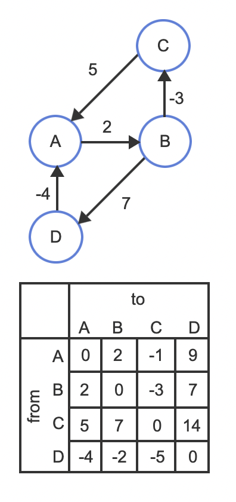

# floyd-warshall

Find shortest path between all pairs of vertices.

Pseudo-code:

```
For k = 0 to n – 1 
    For i = 0 to n – 1 
        For j = 0 to n – 1 
            Distance[i, j] = min(Distance[i, j], Distance[i, k] + Distance[k, j])

where i = source Node, j = Destination Node, k = Intermediate Node
```

```cpp
#include "graph.cpp"

// find shortest path between all pairs of vertices
vector<vector<int>> floydwarshall(Graph graph) {
    int n = graph.getVertices().size();
    vector<vector<int>> distanceMatrix(n, vector<int>(n, INT_MAX));

    // map each vertex to an integer index for easy access in the distance matrix
    unordered_map<Vertex, int, Vertex::HashFunction> vertexToIndex;
    vector<Vertex> vertices = graph.getVertices();
    for (int i = 0; i < n; ++i) {
        vertexToIndex[vertices[i]] = i;
        distanceMatrix[i][i] = 0; // Distance from a vertex to itself is 0
    }

    // set initial distances based on edges in the graph
    unordered_set<Edge, Edge::HashFunction> edges = graph.getEdges();
    for (const Edge& edge : edges) {
        int src = vertexToIndex[edge.source];
        int dest = vertexToIndex[edge.destination];
        distanceMatrix[src][dest] = edge.weight;
    }

    // application of floyd-warshall's
    for (int k = 0; k < n; ++k) {
        for (int i = 0; i < n; ++i) {
            for (int j = 0; j < n; ++j) {
                if (distanceMatrix[i][k] != INT_MAX && distanceMatrix[k][j] != INT_MAX) {
                    int poss = distanceMatrix[i][k] + distanceMatrix[k][j];
                    distanceMatrix[i][j] = min(distanceMatrix[i][j], poss);
                }
            }
        }
    }

    return distanceMatrix;
}

int main() {
    vector<Edge> edges = {
        Edge(Vertex("A"), Vertex("B"), 2),
        Edge(Vertex("B"), Vertex("C"), -3),
        Edge(Vertex("B"), Vertex("D"), 7),
        Edge(Vertex("C"), Vertex("A"), 5),
        Edge(Vertex("D"), Vertex("A"), -4)
    };

    Graph graph(edges);

    vector<vector<int>> distanceMatrix = floydwarshall(graph);

    for (const auto& row : distanceMatrix) {
        for (const auto& col : row) {
            if (col == INT_MAX) {
                cout << "INF ";
            } else {
                cout << col << " ";
            }
        }
        cout << endl;
    }
}
```

<figure><figcaption><p>Distance matrix after Floyd-Warshall's</p></figcaption></figure>
