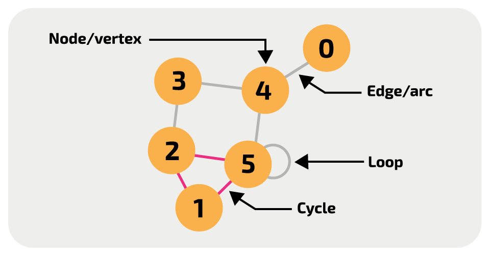

# 👽 what's a graph?

abstract data-type representing non-linear relationships between objects

* nodes contain data values, while edges represent relationship
* edges can be assigned weights, parameters that measure priority, cost, or accuracy

<figure><figcaption></figcaption></figure>

* cycle path: first and last node the same, simple path: unique nodes
  * path length = number of edges
  * distance = least number of edges from A to B
* edges can only connect 2 vertices
* two vertices connected with an edge are adjacent

Basic implementation of a graph:

```cpp
#include <bits/stdc++.h>

using namespace std;

class Vertex {
    public:
        Vertex(string label) : label(label) {}

        string getLabel() const {
            return label;
        }

        bool operator==(const Vertex& other) const {
            return label == other.label;
        }
    
        // Hash function to use Vertex in unordered_map
        struct HashFunction {
        size_t operator()(const Vertex& v) const {
            return hash<string>()(v.getLabel());
        }
    };
    private: 
        string label;
};

class Edge {
    public:
        Vertex source;
        Vertex destination;
        double weight;

        // initializer list ctor
        Edge(Vertex source, Vertex destination, double weight); 
};

// can declare outside of class
Edge::Edge(Vertex source, Vertex destination, double weight) : source(source), destination(destination), weight(weight) {}

// simpler representation of edges for integer vertices
// [source, destination, weight] vectors
// vector<vector<int>> edges;

class Graph {
    public:
        Graph(const vector<Edge>& edges) {
            for (const Edge& edge : edges) {
                addEdge(edge.source, edge.destination, edge.weight);
            }
        }
        Vertex addVertex(string label) {
            Vertex newVertex = Vertex(label);
            adjacencyList[newVertex];
            return newVertex;
        }
        void addEdge(const Vertex& source, const Vertex& destination, double weight) {
            Edge edge(source, destination, weight);
            adjacencyList[source].push_back(edge);
            adjacencyList[destination].push_back(edge); // For undirected graphs, add both directions
        }

        vector<Vertex> getVertices() const {
            vector<Vertex> vertices;
            for (const auto& pair : adjacencyList) {
                vertices.push_back(pair.first);
            }
            return vertices;
        }

        const vector<Edge>& getEdges(const Vertex& vertex) const {
            auto it = adjacencyList.find(vertex);
            if (it != adjacencyList.end()) {
                return it->second;
            }
            throw runtime_error("Vertex not found in the graph.");
        }

    private:
        unordered_map<Vertex, vector<Edge>, Vertex::HashFunction> adjacencyList;
};
```
